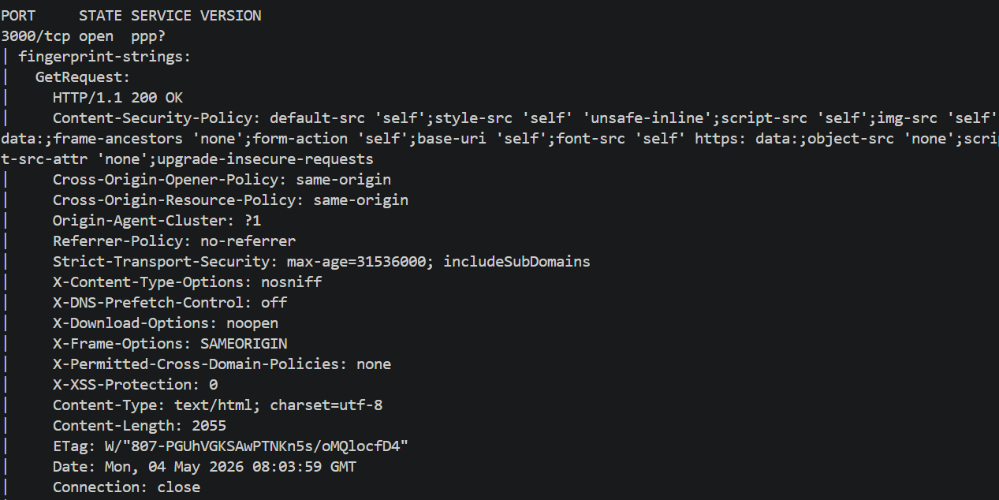
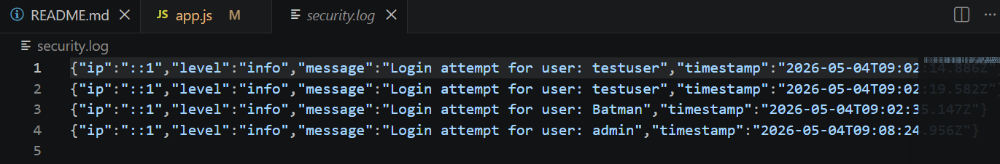

# 🛡️ Final Security Audit & Hardening Report
**Project:** Secure Node.js Authentication System  
**Auditor:** Muhammad Wahab  
**Date:** May 2026  
**Status:** **SECURE ✅**

---

## 📑 Executive Summary
This report documents the security transformation of a Node.js application over a 3-week period. The project evolved from a highly vulnerable state (Week 1) to a security-hardened environment (Week 2), followed by a comprehensive audit and logging implementation (Week 3). The final system aligns with **OWASP Top 10** security standards.

---

## 🕵️‍♂️ Week 1: Vulnerability Findings
In the initial phase, the application was found to be "Insecure by Design." Multiple critical vulnerabilities were identified:

1. **SQL Injection:** No input sanitization in database queries.
2. **Broken Authentication:** Passwords were stored in **Plain Text**.
3. **Missing Security Headers:** No protection against Clickjacking or XSS.
4. **No Rate Limiting:** Vulnerable to Brute Force attacks.

#### **Evidence: Initial Discovery**

*(Initial scans showed automated tool with vulnerbilities.)*

---

## 🛠️ Week 2: Security Fixes & Implementation
The application was "hardened" by implementing industry-standard security libraries and logic.

### **Key Security Implementations:**
- **Helmet.js:** To set secure HTTP headers.
- **Bcrypt:** For salted password hashing (10+ rounds).
- **Express-Rate-Limit:** To prevent Brute Force.
- **CSURF:** To mitigate Cross-Site Request Forgery.

#### **Code Snippet: Secure Configuration**
```javascript
// Security Middleware Integration
app.use(helmet()); // Sets security headers
const limiter = rateLimit({ windowMs: 15 * 60 * 1000, max: 5 }); // Brute force protection
app.use('/login', limiter);

---

## 🔍 Week 3: Advanced Audit & Monitoring
The final phase focused on verifying the implemented defenses and establishing a robust audit trail.

### **1. Network Fingerprinting (Nmap Audit)**
Performed an aggressive Nmap scan to verify that the defenses are visible and active at the network layer.
*   **Result:** The scan confirmed that `X-Frame-Options`, `CSP`, and `HSTS` headers are correctly reported by the server.

#### **Evidence: Header Verification**


### **2. Winston Logging (The Digital Blackbox)**
Integrated a centralized logging system to ensure accountability for all security-sensitive events.
*   **File:** `security.log`
*   **Function:** Automatically records every signup and login attempt (Success/Failure) along with the source IP and timestamp.

#### **Evidence: Audit Logs**


---

## 📊 Before vs. After Comparison (Security Posture)

| Security Feature | Week 1 (Vulnerable) | Week 3 (Hardened) |
| :--- | :--- | :--- |
| **Password Storage** | Plain Text (Dangerous) | **Bcrypt Hashed** (Secure) |
| **Input Validation** | None (SQLi/XSS Risk) | **Sanitized & Parameterized** |
| **Network Security** | Zero Headers | **Helmet.js Suite Active** |
| **Brute Force** | Unlimited Attempts | **Rate Limited** (5 per 15 min) |
| **Audit Trail** | None | **Automated Winston Logs** |

---

## ✅ Final Security Checklist Completion
- [x] Input Sanitization & Escaping (Validator.js)
- [x] Secure Password Hashing (Bcrypt)
- [x] Brute Force Mitigation (Rate Limiting)
- [x] Network Layer Defense Verification (Nmap)
- [x] Real-time Security Event Logging (Winston)

---

## 🎯 Conclusion
The application is now production-ready and hardened against common web threats. We have successfully minimized the attack surface by blocking entry points, encrypting sensitive data, and establishing a real-time monitoring system. The system is now resilient against SQLi, XSS, Brute Force, and Clickjacking attacks.

**Final Auditor Signature:**  
**M.WAHAB
