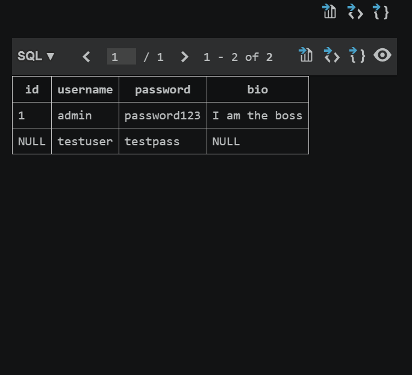

# Cyber-Security-Internship-2026
3-Week Cybersecurity Internship Project: Vulnerability Assessment, Exploitation (SQLi, XSS), and Secure Coding Remediation in Node.js.
# 🛡️ Cybersecurity Internship Project (Node.js)

## 📝 Project Overview
This repository documents my 3-week Cybersecurity Internship project. The primary objective is to identify, assess, and remediate critical security vulnerabilities in a custom Node.js/Express web application. 

This project demonstrates the transition from an **Attacker Mindset** (identifying loopholes) to a **Defender Mindset** (implementing secure coding practices).

## 🚀 Week 1: Vulnerability Assessment & Penetration Testing
During the first week, I deployed an intentionally vulnerable Node.js application and performed manual security testing to understand how real-world exploits work.

### 🔍 Findings & Risk Matrix
Below is the Vulnerability Risk Assessment Matrix based on my manual testing. *(Risk Score = Likelihood × Impact)*

| Vulnerability | Tool Used | Likelihood | Impact | Risk Score | Risk Level | Status |
|---|---|---|---|---|---|---|
| SQL Injection (Auth Bypass) | Manual | 5 | 5 | 25 | 🔴 Critical | Unpatched |
| Stored XSS (Profile Bio) | Manual | 4 | 4 | 16 | 🔴 Critical | Unpatched |
| Plain-Text Password Storage | Manual (DB inspect) | 4 | 5 | 20 | 🔴 Critical | Unpatched |
| Absence of Anti-CSRF Tokens | OWASP ZAP | 3 | 4 | 12 | 🟠 High | Unpatched |
| CSP Header Not Set | OWASP ZAP | 4 | 2 | 8 | 🟡 Medium | Unpatched |
| CSP: No Fallback Directive | OWASP ZAP | 4 | 2 | 8 | 🟡 Medium | Unpatched |
| Missing Anti-clickjacking Header | OWASP ZAP | 3 | 3 | 9 | 🟡 Medium | Unpatched |
| X-Powered-By Header Leaks Tech Stack | OWASP ZAP | 5 | 1 | 5 | 🔵 Low | Unpatched |
| X-Content-Type-Options Missing | OWASP ZAP | 4 | 1 | 4 | 🔵 Low | Unpatched |
| Authentication Request Exposed | OWASP ZAP | 2 | 1 | 2 | ⚪ Info | Noted |

### 🔑 Plain-Text Password Storage
Passwords are stored without hashing in the SQLite database, 
exposing all user credentials if the database is ever accessed.



### 🔬 Exploits Demonstrated
1. **Authentication Bypass (SQLi):** Successfully bypassed the login mechanism using payload `' OR '1'='1` due to lack of parameterized queries.
2. 
3. **Arbitrary Code Execution (Stored XSS):** Injected malicious JavaScript `<script>alert(1)</script>` into the user profile biography, which executed upon page load due to missing output sanitization.
4. 

### 🛠️ Tools & Technologies Used
* **Backend:** Node.js, Express.js
* **Database:** SQLite (In-Memory)
* **Testing Techniques:** Manual Penetration Testing, Risk Assessment Matrix
* ### 📄 Automated Testing (OWASP ZAP)
As part of the security assessment, an automated scan was performed using OWASP ZAP to identify misconfigurations and missing security headers.


* [View Full OWASP ZAP HTML Report](2026-04-19-ZAP-Report-.html)

## 📁 Project Structure

| File/Folder | Purpose |
|---|---|
| `app.js` | Main Express server with vulnerable routes |
| `views/` | EJS templates for login, signup, profile pages |
| `ScreenShots/` | Evidence screenshots from vulnerability testing |
| `ZAP_Report_Week1.html` | Full OWASP ZAP automated scan report |
| `Cybersecurity_Report_Week1_Final.pdf` | Formal findings document |

## 💻 Setup Instructions (For Educational Purposes Only)
If you want to run this vulnerable lab locally:

1. Clone this repository: 
   ```bash
   git clone <your-github-repo-link-here>
   ```
2. Install the required dependencies: 
   ```bash
   npm install express ejs body-parser sqlite3
   ```
3. Run the server: 
   ```bash
   node app.js
   ```
4. Access the vulnerable application at `http://localhost:3000`

> ⚠️ **Disclaimer:** This repository contains intentionally vulnerable code designed strictly for educational and testing purposes. Do not deploy this code in a production environment.

## 🛠️ Areas of Improvement

Based on the vulnerability assessment, the following fixes are 
planned for Week 2:

1. **SQL Injection** → Replace raw queries with parameterized 
   statements using SQLite's `?` placeholders.
2. **Stored XSS** → Sanitize all user inputs using the `validator` 
   npm library before storing or rendering.
3. **Plain-Text Passwords** → Hash passwords using `bcrypt` with 
   salt rounds of 10 before database storage.
4. **Missing Security Headers** → Apply `helmet.js` middleware to 
   set CSP, X-Frame-Options, X-Content-Type-Options headers 
   automatically.
5. **CSRF Protection** → Add CSRF token middleware using `csurf` 
   to protect all form submissions.
6. **X-Powered-By Leak** → Disable Express fingerprinting with 
   `app.disable('x-powered-by')`.
---
*Stay tuned for Week 2, where I will be implementing Parameterized Queries, Input Sanitization (Validator), and Password Hashing (Bcrypt) to secure this application!*
